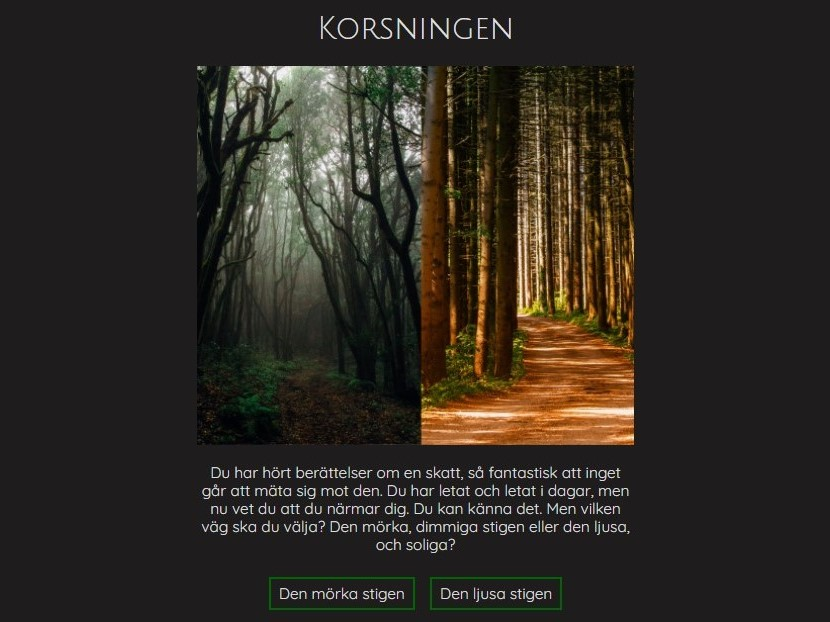
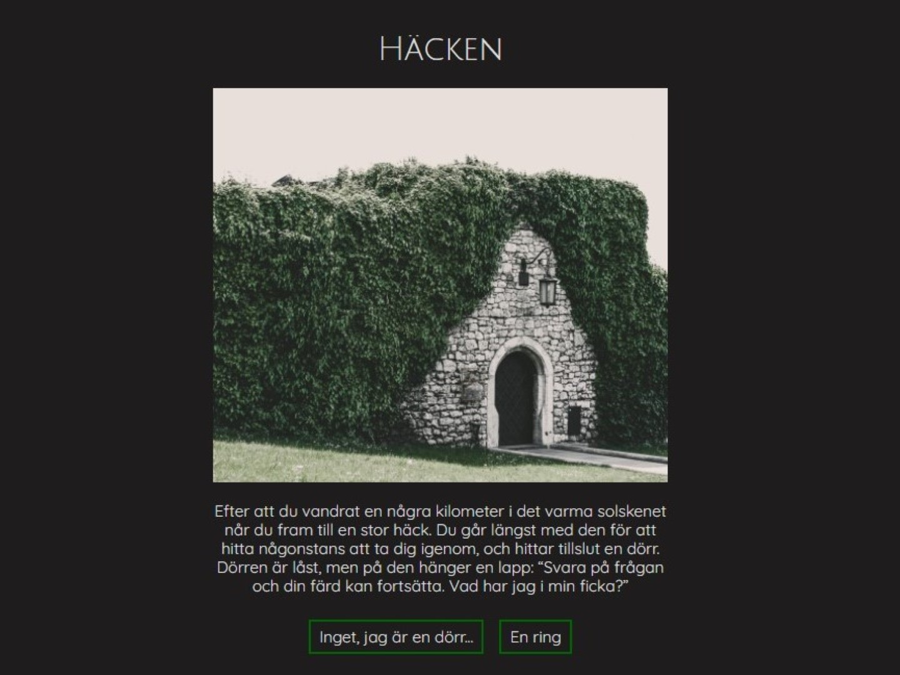

# MVC Projekt - Adventure Game

<p align="center">
<a href="https://travis-ci.org/VeronicaAxelsson/mvc-projekt"></a>
<a href="https://scrutinizer-ci.com/g/VeronicaAxelsson/mvc-projekt/?branch=master"></a>
<a href="https://scrutinizer-ci.com/g/VeronicaAxelsson/mvc-projekt/?branch=master""></a>
<a href="https://scrutinizer-ci.com/g/VeronicaAxelsson/mvc-projekt/?branch=master"></a>

This is a protected created as examination in the course DV1608 V21 lp4 Objektorienterade webbteknologier, Webbprogrammerin Blekinge Tekniska Högskola.

The project is built with the help of the framework [Laravel](https://laravel.com/) 

The main focus of this project is an adventure game, where you travel through the wood in search of the Treasure.

 


## Table of content
* [Play game](#play-game)
* [Development](#development)
* [Class, interface, trait](#class-interface-trait)


## Play game
The game can be played at:


## Development
Clone repo and install local enviroment to work as a developer with make.

```text
make install
make test
```

## Class, interface, trait
The following classes and traits exists.

| Class, trait                       | Description |
|------------------------------------|-------------|
| `App\Classes\Adventure\Adventure`            | A class that takes care of the game logic.  |
| `App\Classes\Adventure\AdventureRoom`        | A trait containing metohods for getting information about room and paths from database. |
| `App\Class\Dice\Dice`                        | A class representing a dice.
| `App\Class\Dice\DiceHand`                    | A class containing logic for throwing dice.

## Models
The following database models exists.

| Model                       | Description |
|------------------------------------|-------------|
| `App\Models\Room`            | Model representing the rooms in the adventure game.  |
| `App\Models\RoomToRoom`           | Model representing the paths between the rooms. |

## Controllers
The following controllers exists.

| Model                       | Description |
|------------------------------------|-------------|
| `App\Http\Controllers\IndexController`            | Controller for welcome page.  |
| `App\Http\Controllers\AdventureController`            | Controller for the Adventure Game. |
